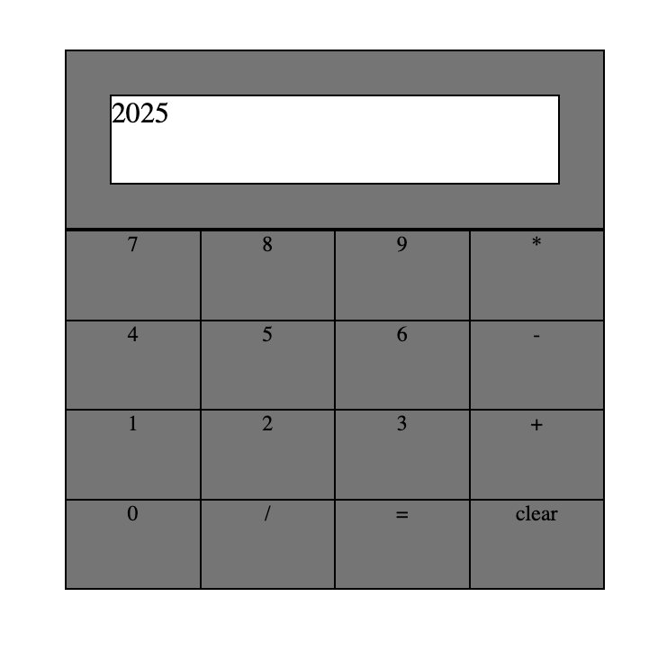

# Web Calculator

`Web Calculator` is a clean and responsive browser-based calculator built with `HTML`, `CSS`, and `JavaScript`. It performs basic operations such as addition, subtraction, multiplication, and division.

